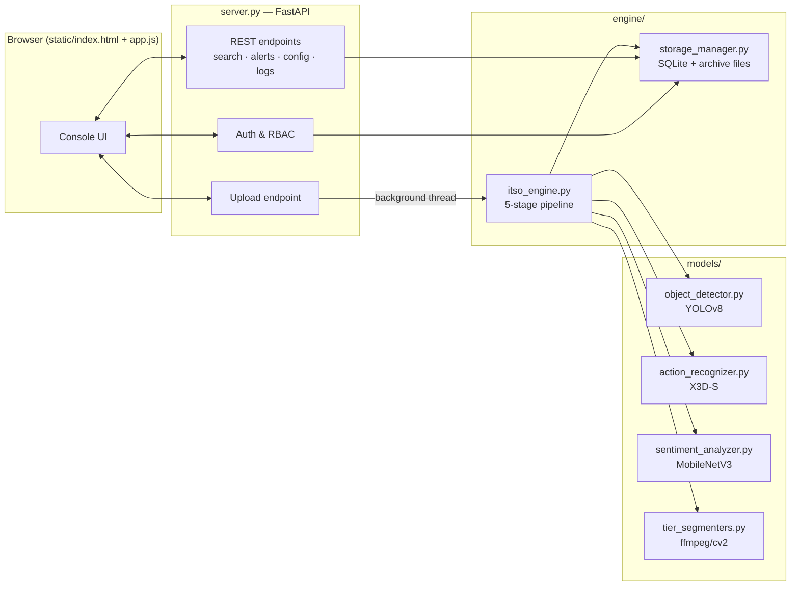

# Architecture

## System overview

Quintrix ITSO is a single FastAPI service that also serves its own frontend as
static files. There is no separate frontend build step and no external
database service — everything runs from one process against a local SQLite
file.



## The 5-stage ITSO pipeline

Every upload runs through `itso_engine.process_project()` on a background
thread so the HTTP request returns immediately with `status: "processing"`.

1. **Ingestion** — probe the file with OpenCV for duration/fps/resolution/codec,
   then cut it into fixed 15-second segments (`segment_seconds` in config).
2. **Invaligator motion filter** — a MOG2 background-subtractor checks each
   segment for real motion above `motion_sensitivity`. Static segments skip
   the expensive deep-analysis stage entirely and are auto-tiered `LOW`.
3. **Ensemble deep analysis** — segments with motion run through all three
   models in sequence:
   - YOLOv8 (`object_detector.py`) → object list with bounding boxes and confidence
   - X3D-S (`action_recognizer.py`) → top-5 Kinetics-400 action predictions
   - MobileNetV3 + a threat head (`sentiment_analyzer.py`) → sentiment score and threat level
4. **Prioritization (Ssig)** — `itso_engine.py` combines detection confidence,
   motion ratio, and context modifiers (weapon/crowd/night boosts from
   `config.context_rules`) into a single 0–1 significance score, and derives a
   hazard level from the object/action mix.
5. **Tiered storage** — `tier_segmenters.py` writes the segment to disk
   according to its tier:
   - `HIGH` (Ssig ≥ `threshold_high`) — original clip kept lossless
   - `MEDIUM` (between the two thresholds) — re-encoded at a lower bitrate
   - `LOW` (below `threshold_low`, or no motion) — a single JPEG keyframe only

Segments at or above `alert_threshold` also write a row to `events` and
`alerts`, which is how the Alerts view and the nav bar's alert dot get their
data — there is no separate "check for alerts" job.

## Alternative action-recognition backend (opt-in)

`models/action_recognizer_r3d18.py` adds a second action/anomaly-recognition
model — a torchvision `r3d_18` (ResNet3D-18) fine-tuned with a 14-class head
matching the UCF-Crime class set (13 anomaly classes + Normal) — as a
drop-in alternative to the default X3D-S backend. It is purely additive:

- Selected via the `action_model_backend` config key (`x3d` default, `r3d18`
  opt-in), editable from the Configuration view or `POST /api/config`.
- Dispatched by `engine/itso_engine.py::recognize_actions()`, which falls
  back to X3D-S automatically if the r3d18 backend is selected but
  `r3d18_best.pt` isn't present — a bad/missing config value can't break the
  pipeline.
- Same output shape as the X3D backend (top-5 `{action, confidence}`), so no
  downstream code (Ssig scoring, storage, UI) needed to change.
- Weights load from `r3d18_best.pt` at the project root by default,
  overridable with the `R3D18_WEIGHTS` env var.

## Data layer

`engine/storage_manager.py` owns every table and is the only module that
touches SQLite directly (WAL mode, `PRAGMA foreign_keys = ON`). Cascade
relationships:

```
projects (1) ──▶ (n) segments ──▶ (n) events
                              └──▶ (n) alerts   [both ON DELETE CASCADE]
```

Deleting a project cascades through segments → events/alerts, and also
unlinks the archived video, thumbnails, and tier output files from disk
(`server.py::delete_project`). See the project changelog for a real defect
found and fixed in this cascade.

## Frontend

`static/index.html` is a single shell with two top-level sections — the auth
gate and the console — toggled by `app.js`. There is no build step, router
library, or framework: `app.js` keeps a `VIEWS` object keyed by nav id, and
`go(id)` swaps `#view`'s `innerHTML` by calling the matching view function,
which fetches from the REST API and renders template strings. This keeps the
whole frontend at ~400 lines with zero dependencies to install or update.

## Device selection (FR60)

`itso_engine.select_device()` tries CUDA, then Apple's MPS backend, then
falls back to CPU — checked once at startup and reused for every inference
call. No configuration needed on any platform.

## Failure isolation

Each model call in the ensemble stage is wrapped in its own try/except that
logs and returns an empty result rather than raising. A failure in action
recognition (for example) does not block object detection, sentiment scoring,
or tiering for that segment — the pipeline always finishes and the project
always reaches `done` or `failed`, never stuck in `processing`.
