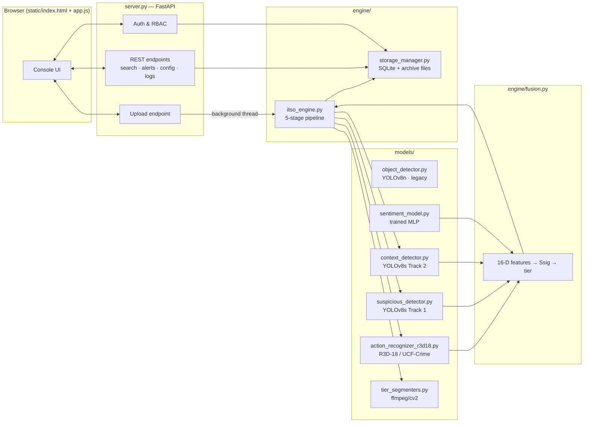

# Architecture

## System overview

Quintrix ITSO is a single FastAPI service that also serves its own frontend as
static files. There is no separate frontend build step and no external
database service — everything runs from one process against a local SQLite
file.



> **Which models are deployed** is documented in [MODELS.md](MODELS.md), which
> is the single source of truth. `GET /api/models` reports the same answer from
> the running system's live config and checkpoint paths.

## The 5-stage ITSO pipeline

Every upload runs through `itso_engine.process_project()` on a background
thread so the HTTP request returns immediately with `status: "processing"`.

1. **Ingestion** — probe the file with OpenCV for duration/fps/resolution/codec,
   then cut it into fixed 15-second segments (`segment_seconds` in config).
2. **Invaligator motion filter** — a MOG2 background-subtractor checks each
   segment for real motion above `motion_sensitivity`. Static segments skip
   the expensive deep-analysis stage entirely and are auto-tiered `LOW`.
3. **Frame sampling** — the buffered frames (decimated across the whole
   segment) are split between the two consumers: 16 uniformly-spaced frames for
   action recognition, and ~1 frame per second for the detectors. Running YOLO
   on every frame costs roughly 25× more for detections that do not change that
   fast.
4. **Inference and fusion** — segments with motion run through the deployed
   models, and `engine/fusion.py` joins their outputs:
   - R3D-18 (`action_recognizer_r3d18.py`) → 14-class UCF-Crime distribution
   - YOLOv8s Track 1 (`suspicious_detector.py`) → 8 threat classes, with `frame_hits`
   - YOLOv8s Track 2 (`context_detector.py`) → COCO context objects and crowd counts
   - the trained MLP (`sentiment_model.py`) → 0–1 sentiment score from a 16-D
     feature vector built from all of the above

   `fusion.fuse()` then weights three channels (action 0.40 / objects 0.35 /
   sentiment 0.25), applies context modifiers (weapon, fire, crowd, night,
   unattended, and an uncertainty penalty), and floors any critical hazard at
   HIGH. It returns a `trace` explaining every contribution — tiering is
   irreversible, so the score is auditable by construction.
5. **Tiered storage** — `tier_segmenters.py` writes the segment to disk
   according to its tier:
   - `HIGH` (Ssig ≥ `threshold_high`) — original clip kept lossless
   - `MEDIUM` (between the two thresholds) — re-encoded at a lower bitrate
   - `LOW` (below `threshold_low`, or no motion) — a single JPEG keyframe only,
     with the original video parked in `purge_queue` for `tier3_grace_hours`
     before it is destroyed (see *Tier-3 safeguard* below)

Segments at or above `alert_threshold` also write a row to `events` and
`alerts`, which is how the Alerts view and the nav bar's alert dot get their
data — there is no separate "check for alerts" job.

## Per-stage reduction telemetry

Each stage writes a `stage_stats` row during the run, recording items/bytes/
frames in and out plus wall time. Because the numbers are measured rather than
reconstructed, the Workflow Simulator's funnel describes what actually happened
to a specific video.

Each stage reduces a different quantity, so the row records which one is
primary: stage 1 is decomposition (bytes, ~unchanged under stream copy), stage
2 reduces *segments* reaching the models, stage 3 reduces *frames*, stage 4
collapses pixels into one searchable record, and stage 5 reduces *bytes on
disk*.

All savings are reported against `projects.original_bytes` — the file the
operator uploaded. An earlier version overwrote that column with the sum of the
pipeline's own segment files, which made every percentage a comparison against
a baseline the pipeline had generated.

## Tier-3 safeguard

Tier 3 keeps keyframes only; the moving footage is gone. A wrong significance
score is therefore unrecoverable, so deletion is deferred rather than immediate:

```
LOW segment ──► archive/pending_purge/ + purge_queue row (deadline = now + grace)
                       │
      operator restores ├──► re-tiered to MEDIUM/HIGH, video kept
      operator confirms ├──► deleted now
      deadline passes   └──► background sweeper deletes it
```

`itso_engine.start_purge_worker()` runs the sweeper from `server.py`, so the
deadline is enforced by the running service. `tier3_grace_hours = 0` restores
the previous delete-immediately behaviour.

## Pipeline profiles

`pipeline_profile` selects which pipeline `process_project()` runs:

- **`fusion`** (default, deployed) — the five stages above, using R3D-18 +
  Track 1 + Track 2 + the trained scoring MLP.
- **`legacy`** — the original X3D-S + COCO YOLOv8n + MobileNetV3 path,
  retained so the two can be compared on identical footage.

Both fill the same segment row shape, so the database, search, UI and API never
need to branch on which pipeline produced a segment. Segments record their own
`pipeline_profile`, `action_backend` and `sentiment_backend`, and the UI says
plainly when a segment predates the fusion stage and therefore has no score
trace.

`action_model_backend` (`x3d` | `r3d18`) selects the action backend **for the
legacy profile only**. The fusion profile always uses R3D-18, because its
scoring depends on UCF-Crime class severity that Kinetics-400 labels cannot
express — see [MODELS.md](MODELS.md) for the full reconciliation.

Checkpoints resolve through a search order (`$R3D18_WEIGHTS` →
`weights/r3d18_ucfcrime.pt` → `r3d18_best.pt`), and `loaded_from()` reports
which file is actually in memory so the docs and the running system cannot
disagree.

## Data layer

`engine/storage_manager.py` owns every table and is the only module that
touches SQLite directly (WAL mode, `PRAGMA foreign_keys = ON`). Cascade
relationships:

```
projects (1) ──▶ (n) segments ──▶ (n) events
                              └──▶ (n) alerts   [both ON DELETE CASCADE]
```

Deleting a project cascades through segments → events/alerts, and also
unlinks the archived video, thumbnails, and tier output files from disk
(`server.py::delete_project`). See the project changelog for a real defect
found and fixed in this cascade.

## Frontend

`static/index.html` is a single shell with two top-level sections — the auth
gate and the console — toggled by `app.js`. There is no build step, router
library, or framework: `app.js` keeps a `VIEWS` object keyed by nav id, and
`go(id)` swaps `#view`'s `innerHTML` by calling the matching view function,
which fetches from the REST API and renders template strings. This keeps the
whole frontend at ~400 lines with zero dependencies to install or update.

## Device selection (FR60)

`itso_engine.select_device()` tries CUDA, then Apple's MPS backend, then
falls back to CPU — checked once at startup and reused for every inference
call. No configuration needed on any platform.

## Failure isolation

Each model call in the ensemble stage is wrapped in its own try/except that
logs and returns an empty result rather than raising. A failure in action
recognition (for example) does not block object detection, sentiment scoring,
or tiering for that segment — the pipeline always finishes and the project
always reaches `done` or `failed`, never stuck in `processing`.
